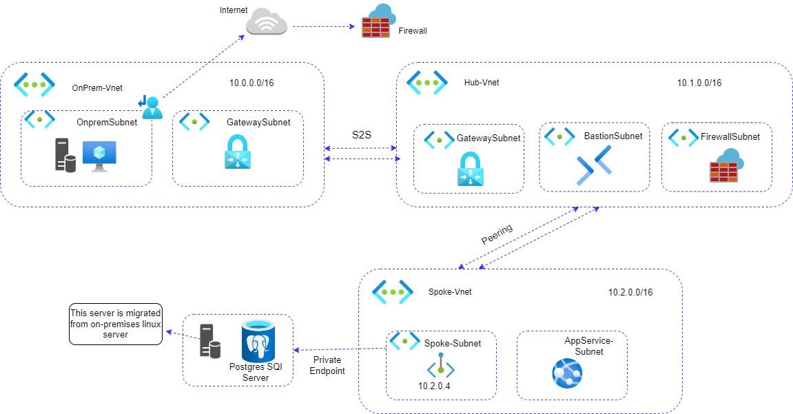

# Azure Hub and Spoke Architecture – Linux Server Migration

## 📘 Project Overview
This Terraform project implements a Hub and Spoke architecture on Azure to support the migration of a Linux server (from on-premises) to Azure, using modular infrastructure-as-code (IaC) design principles.
The infrastructure includes networking, virtual machines, PostgreSQL, private endpoints, and secure connectivity across different virtual networks.

## 📌 Architecture Diagram



## 🔹 VNet Configuration:
- OnPrem-VNet (10.0.0.0/16)

- OnpremSubnet (hosted original Linux server)

- GatewaySubnet (for VPN Gateway)

- Hub-VNet (10.1.0.0/16)

- GatewaySubnet

- BastionSubnet

- FirewallSubnet

- Spoke-VNet (10.2.0.0/16)

- Spoke-Subnet

- AppService-Subnet

## 🔹 Migration:
- A Linux server was migrated from on-premises to Azure.

- It now hosts a PostgreSQL Server in the Spoke network.

- VPN Gateway and VNet peering enable secure communication.

## 🗂 Repository Structure
```
.
├── Images/
│   └── linux.png                  # Architecture diagram
├── modules/                       # Reusable Terraform modules
│   ├── gateway/                   # VPN Gateway configuration
│   ├── linuxvm/                   # Linux VM provisioning and extensions
│   ├── peering/                   # VNet peering between VNets
│   ├── postgres-sql/             # PostgreSQL server deployment
│   ├── private-endpoint/         # Private endpoint configuration
│   ├── public-ip/                # Public IP resource module
│   ├── resource-group/           # Resource group creation
│   └── virtualnetwork/           # VNet and subnet definitions
├── Team-A/                        # Environment-specific configuration
│   ├── hub/                       # Hub network setup
│   ├── on-premises/              # On-prem VNet and migration resources
│   └── spoke/                    # Spoke network and services
├── .gitignore
└── README.md                     # Project documentation
```

## 🧪 Usage
- 1.Clone the repo:
```
git clone <https://github.com/fahimabarveen/Migrate-Linux-workloads-to-Azure.git>
cd Migrate-Linux-workloads-to-Azure
```

- 2.Navigate to the appropriate environment under Team-A/ (e.g., hub, spoke, or on-premises).

- 3.Initialize and apply Terraform:
```
terraform init
terraform apply
```

## 🔐 Security Notes
- VPN Gateway is used to establish secure communication from on-premises.

- Bastion enables secure VM access without exposing public SSH.

- PostgreSQL is accessed via private endpoint, not exposed publicly.