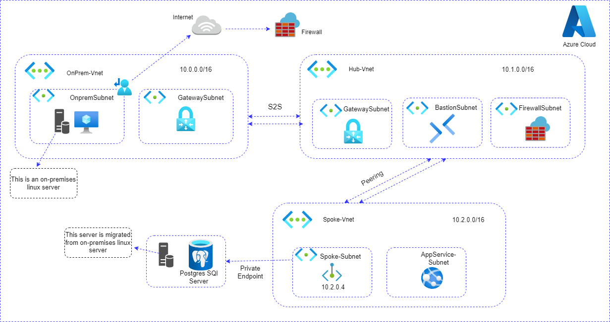

# Azure Hub and Spoke Architecture – Linux Server Migration

[](https://azure.microsoft.com/en-us/resources/cloud-computing-dictionary/what-is-azure) [](https://learn.microsoft.com/en-us/azure/virtual-network/virtual-networks-overview) [](https://learn.microsoft.com/en-us/azure/firewall/overview) [](https://learn.microsoft.com/en-us/azure/bastion/bastion-overview) [](https://learn.microsoft.com/en-us/azure/vpn-gateway/vpn-gateway-about-vpngateways)

## 📘 Project Overview
This Terraform project implements a Hub and Spoke architecture on Azure to support the [migration of a Linux server](https://microsoft.github.io/TechExcel-Migrate-Linux-workloads/) (from on-premises) to Azure, using modular infrastructure-as-code (IaC) design principles.
The infrastructure includes networking, virtual machines, PostgreSQL, private endpoints, and secure connectivity across different virtual networks.

## 📌 Architecture Diagram



## 🧭 Architecture Overview
### 🔷 Key Components
###### OnPrem-VNet - (10.0.0.0/16):

- Simulates on-premises network with a Linux server.

- Connected to Azure via S2S VPN Gateway.

###### Hub-VNet - (10.1.0.0/16):

Contains centralized services like:

- Azure Firewall

- Bastion Host

- VPN Gateway

Acts as the central connectivity point for all spokes.

###### Spoke-VNet - (10.2.0.0/16):

- Hosts migrated Linux server.

Contains:

- AppService Subnet

- PostgreSQL Database (via Private Endpoint)

- Peered with Hub-VNet for secure routing.

## 🔹 Migration:
- A Linux server was migrated from on-premises to Azure.

- It now hosts a PostgreSQL Server in the Spoke network.

- VPN Gateway and VNet peering enable secure communication.

## 📁 Repository Structure
```
.
├── Images/
│   └── linux-mig.png            # Architecture diagram
├── Linux-Migrate/
│   ├── hub/                     # Hub network and components
│   ├── on-premises/             # On-premises simulation setup
│   ├── spoke/                   # Spoke VNet and workloads
├── modules/                     # Reusable Terraform modules
│   ├── bastion-host/
│   ├── firewall/
│   ├── gateway/
│   ├── linuxvm/
│   ├── local-network-gw/
│   ├── nsg/
│   ├── nsg-associate/
│   ├── postgre-sql/
│   ├── private-endpoint/
│   ├── public-ip/
│   ├── resource-group/
│   ├── route-table/
│   ├── virtualnetwork/
│   ├── vnet-peering/
│   └── vpn-connection/
├── .gitignore
└── README.md

```
## ✅ Modules and Responsibilities
| Module Name        | Purpose                                |
| ------------------ | -------------------------------------- |
| `resource-group`   | Create resource groups                 |
| `virtualnetwork`   | Define VNets (Hub, Spoke, OnPrem)      |
| `route-table`      | Define route rules                     |
| `nsg`              | Define NSGs for subnet-level security  |
| `nsg-associate`    | Associate NSGs with subnets            |
| `gateway`          | Create VPN Gateway                     |
| `local-network-gw` | Simulate on-prem gateway               |
| `vpn-connection`   | S2S VPN configuration                  |
| `vnet-peering`     | Hub-Spoke VNet Peering setup           |
| `bastion-host`     | Bastion for secure SSH to VM           |
| `firewall`         | Azure Firewall configuration           |
| `linuxvm`          | Provision Linux VM in Spoke            |
| `public-ip`        | Public IP address for services         |
| `postgre-sql`      | Deploy PostgreSQL Server               |
| `private-endpoint` | Private Endpoint for DB access from VM |


## 🔧 How to Use
- 1.Clone the repo:
```
git clone https://github.com/srinivasan2022/Migrate-Linux-workloads-to-Azure.git
cd Migrate-Linux-workloads-to-Azure
```

- 2.Navigate to the appropriate environment under Linux-Migrate/ (e.g., hub, spoke, or on-premises)..

- 3.Initialize Terraform
```
terraform init
```
- 4.Plan the deployment
```
terraform plan
```
- 5.Apply the configuration
```
terraform apply
```

## 🔐 Security Notes
- VPN Gateway is used to establish secure communication from on-premises.

- Bastion enables secure VM access without exposing public SSH.

- PostgreSQL is accessed via private endpoint, not exposed publicly.

## 🧠 Purpose
- This project showcases secure hybrid cloud architecture.

- Enables lift-and-shift Linux workload migration from on-prem to Azure.

- Demonstrates infrastructure modularity using Terraform.

## 👥 Contributors

This project was developed by [Srinivasan V](https://www.linkedin.com/in/seenu2002/) in collaboration with team members [Fahima Barveen P](https://www.linkedin.com/in/fahima-barveen-2473891ba/) and [Aravindhan S](https://www.linkedin.com/in/aravindhan-s-530731301/) .


### Feedback
**Was this document helpful?** </br>
[](#) [](#)


<div align="right"><h4>Written By,</h4>
<a href="https://www.linkedin.com/in/seenu2002/">V.Srinivasan</a>
<h6>Cloud Engineer @ CloudSlize</h6>
</div>

<div align="center">


[](#)

</div>

---